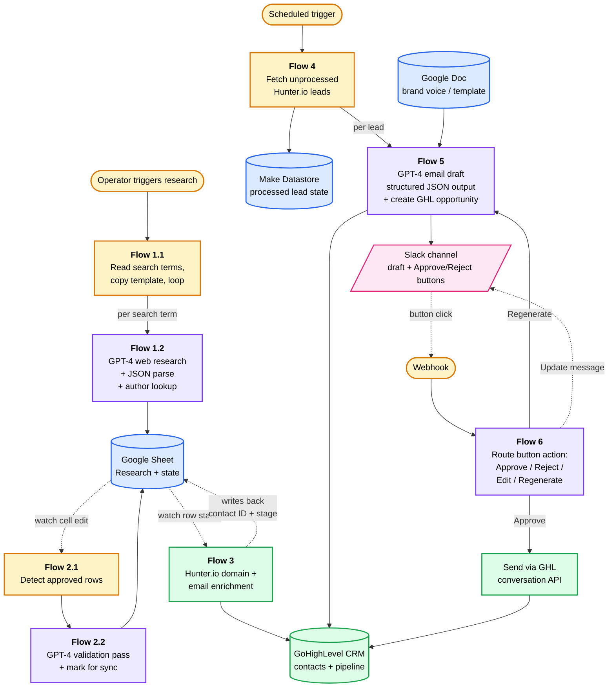

# AI Lead Outreach & Research System

> A 6-stage Make.com pipeline that researches niche blogs, enriches authors as leads, drafts personalized outreach emails with GPT-4, and routes them through a Slack human-in-the-loop approval flow before sending via GoHighLevel.

---

## 🎯 The Problem

A marketing agency client was running outbound to independent blog authors in specific consumer niches. The manual process for a single campaign batch looked like this:

1. Search Google for top-ranking blogs on N seed topics
2. For each blog, find author + domain + contact email (manually, often by visiting the site)
3. Enrich each contact with Hunter.io
4. Decide which leads are worth contacting
5. Write a personalized first-touch email matching the agency's brand voice
6. Push the contact into the right pipeline stage in GoHighLevel
7. Send and track

This consumed two full-time equivalents and quality was inconsistent — emails varied in tone, leads slipped between stages, and the team couldn't scale beyond a handful of campaigns at once.

## 💡 The Solution

A 6-stage Make.com pipeline that automates the entire research → draft → CRM cycle while keeping a human in the loop where it matters most: **final approval before any email leaves**.

The system uses GPT-4 in three distinct roles — **research**, **validation**, and **personalized drafting** — with Google Sheets and a Make datastore as durable state between stages. Drafts surface in Slack with interactive Approve / Reject / Regenerate buttons, so the operator can clear an entire batch from one channel without touching the CRM.

## 🏗️ Architecture

The pipeline runs across **8 Make.com scenarios** organized into 6 logical stages:

| Stage | Scenarios | What happens | AI used |
|-------|-----------|--------------|---------|
| 1. Blog Research | `1.1` + `1.2` | For each search term, GPT-4 web-researches the top independent blogs in that niche, parses the result into structured JSON, then runs a second LLM pass to extract the author's name and email. Results land in a Google Sheet. | GPT-4 (web research), GPT-4 (JSON extraction), GPT-4 (author/email lookup) |
| 2. Approval | `2.1` + `2.2` | A watcher detects when the operator marks a row as approved. A validation LLM pass checks the row and flags it for downstream sync. | GPT-4 (validation) |
| 3. CRM Sync | `3` | Enriches approved leads via Hunter.io (domain + email), then searches/creates the contact in GoHighLevel and places it in the configured pipeline stage. | — |
| 4. Lead Fetcher | `4` | On a schedule, pulls unprocessed leads from Hunter.io and tracks state in a Make datastore so the same lead is never processed twice. | — |
| 5. Email Builder | `5` | Reads the agency's brand voice / template from a Google Doc, then drafts a personalized first-touch email using GPT-4 with **structured JSON output** (`{ subject, email_body }`). Creates an opportunity in GHL and posts the draft to Slack with action buttons. | GPT-4.1 (structured output) |
| 6. Slack Buttons | `6` | A webhook receives Slack button clicks (Approve / Reject / Edit / Regenerate). Approved drafts are sent via the GHL Conversations API. Regenerate loops back to Stage 5 with feedback. | GPT-4 (regenerate on rewrite) |

## 🧠 Engineering decisions worth highlighting

**Multi-scenario over one mega-scenario.** Splitting into 8 Make scenarios linked by `CallSubscenario` and sheet/datastore watchers means each stage can be debugged, replayed, and rate-limited independently. A failed enrichment in Stage 3 doesn't poison the research already done in Stage 1.

**Google Sheets as state, not just data.** Approval columns in the sheet are the source of truth for "ready to sync." This makes the workflow human-debuggable — anyone can open the sheet and see exactly where every lead is.

**Make Datastore for idempotency.** Stage 4 stores processed Hunter.io lead IDs in a Make datastore, so re-running the scheduled fetch never sends duplicate outreach.

**Structured JSON output from the LLM.** Stage 5 uses OpenAI's `json_schema` response format with an `EmailJSON` schema (`{ subject, email_body }`). This eliminates parsing failures and makes downstream Slack/GHL formatting trivial.

**Human-in-the-loop, not human-out-of-the-loop.** The pipeline does the 90% of work that's mechanical (research, enrichment, drafting, formatting) and stops at the 10% that benefits from human judgment (does this email actually sound right for this person?). Interactive Slack buttons make approval take seconds.

## 📊 Results

- ⏱️ **Replaced 2 full-time equivalents** previously doing this work manually
- 🔁 Scaled batch size from "a few" to **hundreds of leads per campaign** without proportional human cost
- ✅ Consistent brand voice across all outreach (single Google Doc template, single LLM, single approval channel)

## 🧰 Built With

- **Orchestration:** Make.com (8 scenarios, router-based branching, subscenarios, datastore)
- **AI:** OpenAI GPT-4 / GPT-4.1 with `json_schema` structured outputs
- **CRM:** GoHighLevel (contacts, opportunities, pipelines, conversations API)
- **Enrichment:** Hunter.io (domain search, email finder, leads API)
- **State & docs:** Google Sheets, Google Docs, Make datastore
- **Human interface:** Slack (interactive blocks with buttons, webhook for actions)

## 🚀 Running / Importing It

> ⚠️ **This is a sanitized reference implementation.** Client identifiers, sheet IDs, document IDs, channel IDs, and example data inside prompts have been replaced with placeholders. Make's credential references (`__IMTCONN__...`) remain — they're just IDs that point to *your* connections in *your* Make account, with no secrets attached. You will need to:

1. Create new Make connections for each integration (Google Sheets, Google Docs, OpenAI, GoHighLevel, Slack, HTTP, datastore).
2. Import each blueprint from [`blueprints/`](blueprints/) in numbered order (1.1 → 6) and re-attach connections.
3. Replace the following placeholders with your own values:
   - `YOUR_RESEARCH_SHEET_ID` — Google Sheet that holds research rows
   - `YOUR_EMAIL_TEMPLATES_DOC_ID` — Google Doc with your brand voice template
   - `YOUR_SLACK_CHANNEL_ID` — Slack channel for draft review
   - `your-email@example.com` — your operator email
4. Set up a Make datastore for Stage 4 (lead idempotency).
5. Configure your Slack app with an interactive webhook pointing at the Stage 6 custom webhook URL.

A helper script that runs the placeholder substitution is included at [`scripts/sanitize_blueprints.py`](scripts/sanitize_blueprints.py) — same tool used to produce this reference version.

## 📝 Notes & Learnings

**The hardest part wasn't the AI, it was the state machine.** Knowing which lead is in which stage, what's been processed, what's awaiting approval — getting that right across 8 scenarios is what made this reliable. The LLM calls are almost the easy part.

**Prompt brittleness around web research.** The Stage 1 "research blogs in Google for term X" pattern depends heavily on the model's tool use and is sensitive to prompt phrasing. The two-pass design (research → re-extract as strict JSON) is what made downstream parsing reliable.

**Slack as a UI layer.** I underestimated how much faster batch approval gets when the reviewer can act from inside a channel they already live in, vs. clicking into a CRM. If I rebuilt this, I'd push more state into Slack messages (current stage badges, last action timestamp).

**If I rebuilt this in 2026.** I'd likely move Stage 1 research to a dedicated agent (LangChain or a Claude tool-use loop) for better control over search strategy and citations, keep Make for the integration glue, and add an eval set for email quality to catch regression when prompts change.

---

*Rewritten with AI from existing documents. See also: [other projects](https://github.com/marequest).*
